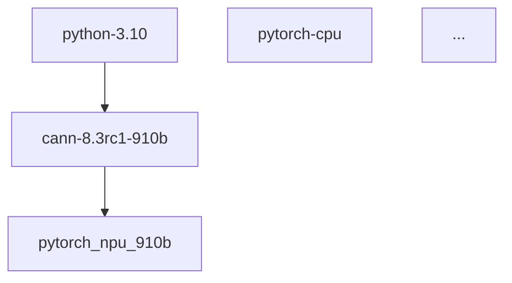
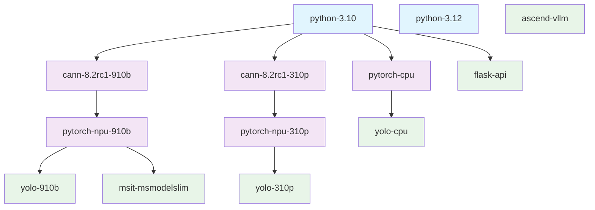

## 自定义镜像构建的难点

1. 窄版本：比如 `pytorch-npu 2.5.1` 依赖 `cann 8.2.rc1`，`pytorch-npu 2.7.1` 依赖 `cann 8.3.rc1`，底层的`numpy`只能是 `1.x`;
2. 场景多：
    - 传统训练场景：比如cnn（yolo等）；
    - 大模型训练场景：依赖（nnal等大模型训练加速包）；
    - 传统推理场景：直接使用pytorch或transformers推理
    - 大模型推理场景：使用vllm-ascend等推理框架
    - cpu训练推理场景
    - 其他框架训推场景
3. 依赖arm环境，且构建中不能验证镜像是否可用。

## 解决方案

如果构建一个大而全的镜像，试图覆盖所有的基础依赖，场景依赖是行不通的，这样会导致dockerfile会很大，很难维护，镜像也会很大，而且可能会有依赖版本冲突。那怎么解决这种问题呢？

### 镜像分层构建

将镜像分为如下几层：
* 基础镜像，包括基础库、常用工具、python环境等；
* cann镜像，包括训练推理中可能用到包，包括toolkits（和nnae二选一），kernels，nnal（大模型场景）等；
* pytorch镜像，包括pytorch和npu扩展包pytorch-npu；
* 场景镜像，面向不同的模型的训推场景都使用自己的镜像，安装所需依赖，保证镜像简洁可维护。

### 声明式定义

通过配置文件的方式声明式定义镜像，包括：
* 镜像名称
* 依赖的上层镜像
* 构建参数：
    * 构建所需dockerfile
    * 环境变量，比如当前镜像需要安装的依赖包版本
* 生成的镜像tag

### 基础扩展能力（TODO）

支持在运行时安装依赖（当前仅支持pip依赖），避免重新构建镜像，可选方式：
1. 挂载外部存储，安装挂载的依赖文件；
2. 使用私有registry。


## Introducing `ascend-docker-factory`

### 下载

```bash
git clone https://github.com/xuopoj/ascend-docker-factory.git
```

### 定义文件参考

参考[dockerfile-compose.yaml](./dockerfile-compose.yaml).

```yaml
images:
  python-3.10: # 镜像的id，其他镜像通过这个id引用
    build:
      context: .
      dockerfile: dockerfiles/python.dockerfile # 当前镜像构建所需的dockerfile
      args:
        PYTHON_VERSION: "3.10" # 指定python版本
        BASE_IMAGE: "ubuntu:22.04"
    tags:
      - "xuopoj/python:3.10" # 构建镜像的tag
  cann-8.2rc1-910b:
    depends_on: # 指定依赖的基础镜像
      - python-3.10
    build:
      ...
    tags:
      - "xuopoj/cann:8.2rc1-910b"
  ...
```

### 构建脚本

参考[build.py](./build.py).

#### 使用方式

```bash
# python build.py -h
usage: build.py [-h] [--target TARGET] [--list] [--graph]

Build Docker images using dockerfile-compose

options:
  -h, --help       show this help message and exit
  --target TARGET  Build specific image and its dependencies
  --list           List all available images
  --graph          Generate Mermaid dependency graph
```

#### 列举所有可构建的镜像

```bash
python build.py --list
Available images:
  python-3.10: xuopoj/python:3.10
  cann-8.3rc1-910b: xuopoj/cann:8.3rc1-910b (depends on: python-3.10)
  pytorch-npu-910b: xuopoj/pytorch:2.5.1-npu-910b (depends on: cann-8.3rc1-910b)
  ...
```

#### 打印镜像依赖树

```bash
python build.py --graph
```

打印结果：
<pre>

</pre>

通过mermaid graph预览可以看到对应的依赖树，当前的镜像依赖树：



### 详细使用介绍

基础说明和参考，可自行调整版本声明和dockerfile定义，适配自己的业务场景。

#### Python基础镜像

配置文件，可通过args指定基础镜像和python版本
```yaml
  python-3.10:
    build:
      context: .
      dockerfile: dockerfiles/python.dockerfile
      args:
        PYTHON_VERSION: "3.10"
        BASE_IMAGE: "ubuntu:22.04"
    tags:
      - "xuopoj/python:3.10"
```

操作命令
```bash
# 构建镜像
python build.py --target python-3.10 # or python-3.12
# 保存镜像
docker save -o python-3.10.tar xuopoj/python:3.10
# tag
docker tag xuopoj/python:3.10 swr.cloud.com/org1/python:3.10
# push
docker push swr.cloud.com/org1/python:3.10
```

预构建镜像下载地址：[python-3.10.tar](http://service-delivery-hub.myhuaweicloud.com/prebuilt-images/python-3.10.tar).

#### 构建昇腾镜像

配置文件，可通过args指定基础镜像,CANN版本等。

```yaml
  cann-8.2rc1-910b:
    depends_on:
      - python-3.10
    build:
      context: .
      dockerfile: dockerfiles/cann.dockerfile
      args:
        BASE_IMAGE: "xuopoj/python:3.10"
        CANN_VERSION: "8.2.RC1"
        CHIP_TYPE: "910b"
        DRIVER_VERSION: "24.1.1"
        INSTALL_COMPONENTS: "toolkit,kernels,nnal"
    tags:
      - "xuopoj/cann:8.2rc1-910b"
```

命令
```bash
# 构建镜像
python build.py --target cann-8.3rc1-910b # or cann-8.2rc1-910b
# 保存镜像
docker save -o cann-8.3rc1-910b.tar xuopoj/cann:8.2rc1-910b
# tag
docker tag xuopoj/cann:8.2rc1-910b swr.cloud.com/org1/cann:8.2rc1-910b
# push
docker push swr.cloud.com/org1/cann:8.2rc1-910b
```

#### 构建pytorch镜像


配置文件，可通过args指定pytorch版本

```yaml
  pytorch-npu-910b:
    depends_on:
      - cann-8.3rc1-910b
    build:
      context: .
      dockerfile: dockerfiles/pytorch-npu.dockerfile
      args:
        BASE_IMAGE: "xuopoj/cann:8.3rc1-910b"
        TORCH_VERSION: "2.5.1"
        TORCH_NPU_VERSION: "2.5.1"
    tags:
      - "xuopoj/pytorch:2.5.1-npu-910b"
```

命令
```bash
# 构建镜像
python build.py --target pytorch-npu-910b
# 保存镜像
docker save -o pytorch-npu-910b-2.5.1.tar xuopoj/pytorch:2.5.1-npu-910b
# tag
docker tag xuopoj/pytorch:2.5.1-npu-910b swr.cloud.com/xuopoj/pytorch:2.5.1-npu-910b
# push
docker push swr.cloud.com/xuopoj/pytorch:2.5.1-npu-910b
```

#### 构建vLLM镜像

配置文件，可通过args指定ascend-vllm版本

```yaml
  ascend-vllm:
    build:
      context: .
      dockerfile: dockerfiles/vllm.dockerfile
      args:
        BASE_IMAGE: "v0.11.0rc2"
    tags:
      - "xuopoj/ascend-vllm:v0.11.0rc2"
```

命令
```bash
# 构建镜像
python build.py --target ascend-vllm
# 保存镜像
docker save -o ascend-vllm-v0.11.0rc2.tar xuopoj/ascend-vllm:v0.11.0rc2
# tag
docker tag xuopoj/ascend-vllm:v0.11.0rc2 swr.cloud.com/org1/ascend-vllm:v0.11.0rc2
# push
docker push swr.cloud.com/org1/ascend-vllm:v0.11.0rc2
```

### 其他参考

#### login

SWR服务中获取登录命令

```bash
docker login -u <u> -p <p> swr.cn-global-1.cloud.nisco.cn
```

### tag

```bash
docker tag minimind:v2 swr.cn-global-1.cloud.nisco.cn/test-modelarts/minimind:v2
```

### push
```bash
docker push  swr.cn-global-1.cloud.nisco.cn/test-modelarts/minimind:v2
```

### 其他使用场景

* [使用ModelArts进行训推指南](./how-to-train-or-infer-with-ma.md) // TODO
* [ModelArts Studio三方模型注册与基础训推](../ma-studio-3rd/README.md) // TODO

## 附录

### Ascend CANN体系组成

昇腾的核心CANN组件列表：
|     package          | size  |                                      说明                                 |
|     ---              | ----  |                                       ---                                  |
|    toolkit           | ~2.0G | CANN开发套件包，在训练&推理&开发调试场景下安装，主要用于训练和推理业务、模型转换、算子/应用/模型的开发和编译。如果要调试需要安装这个安装包  |
|    nnae              | ~1.4G | CANN开发套件包，在训练&推理&开发调试场景下安装，主要用于训练和推理业务，和toolkit二选一，nnae只支持训推能力。      |
|    kernels           | ~1.9G |  CANN二进制算子包，包括单算子API执行（例如aclnn类API）动态库/静态库文件，以及kernel二进制文件。可选，如果没有会在线编译，环境准备会慢一些     |
|    nnal              | ~511M | CANN神经网络加速库，包含ATB（Ascend Transformer Boost）加速库和SiP（Ascend SiP Boost）信号处理加速库。 |


### toolkit 中的组件

* CANN-runtime-*-linux.aarch64.run
* CANN-compiler-*-linux.aarch64.run
* CANN-hccl-*-linux.aarch64.run
* CANN-opp-*-linux.aarch64.run
* Ascend-pyACL_8.1.RC1_linux-aarch64.run
* Ascend-test-ops_8.1.RC1_linux.run

下面是toolkit比nnae中多的组件：

* CANN-toolkit-*-linux.aarch64.run
* CANN-aoe-*-linux.aarch64.run
* CANN-ncs-*-linux.aarch64.run
* Ascend-mindstudio-toolkit_8.0.RC1_linux-aarch64.run

### nnae中的组件

* CANN-opp-*-linux.aarch64.run
* CANN-runtime-*-linux.aarch64.run
* CANN-compiler-*-linux.aarch64.run
* CANN-hccl-*-linux.aarch64.run
* Ascend-pyACL_*_linux-aarch64.run
* Ascend-test-ops_*_linux.run


### kernels组件

* Ascend910B-opp_kernel-*-linux.aarch64.run

### nnal组件[optional]

> LLM场景下建议安装。

* Ascend-cann-atb_*_linux-aarch64.run
