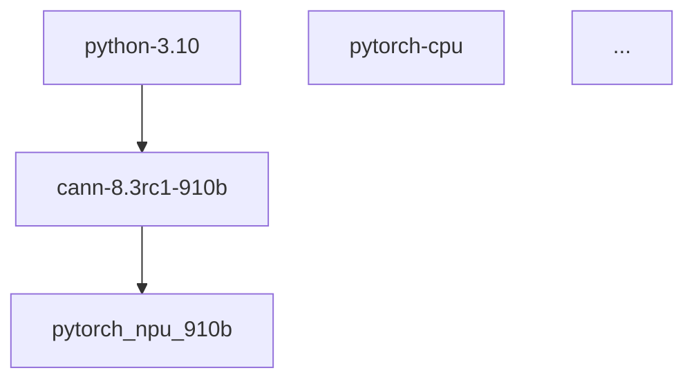
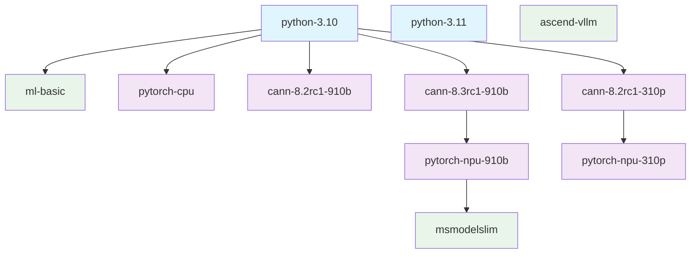
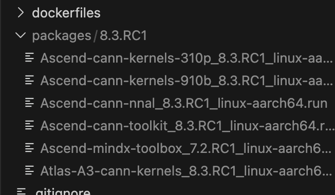

## 自定义镜像构建的难点

1. 窄版本：比如 `pytorch-npu 2.5.1` 依赖 `cann 8.2.rc1`，`pytorch-npu 2.7.1` 依赖 `cann 8.3.rc1`，底层的`numpy`只能是 `1.x`;
2. 场景多：
    - 大模型推理场景：使用vllm-ascend等推理框架
    - 传统训练场景：比如cnn（yolo等）
    - 传统推理场景：直接使用pytorch或transformers推理
    - 大模型训练场景：依赖（nnal等大模型训练加速包）
    - cpu训练推理场景
    - 其他框架训推场景
3. 依赖arm环境，且构建中不能验证镜像是否可用。

## 解决方案

如果构建一个大而全的镜像，试图覆盖所有的基础依赖，场景依赖是行不通的，这样会导致dockerfile会很大，很难维护，镜像也会很大，而且可能会有依赖版本冲突。那怎么解决这种问题呢？

### 镜像分级构建

将镜像分为如下几个层级：
* 基础镜像：包括基础库、常用工具、python环境、cann镜像，包括训练推理中可能用到包，包括toolkits（和nnae二选一），kernels，nnal（大模型场景）等；
* 训练框架镜像：比如pytorch镜像，包括pytorch和npu扩展包pytorch-npu，或者mindspore等其他训练镜像；
* 场景镜像：面向不同的模型的训推场景都使用独立的镜像，安装所需依赖，保证镜像简洁可维护。

### 构建基础镜像

[昇腾镜像中心](https://tools.service-delivery-hub.com/ascend-image-hub) 提供了预构建的昇腾 NPU 镜像，可直接拉取或下载离线包使用。也可以基于本项目自行构建定制镜像。

1. 访问[昇腾镜像中心](https://tools.service-delivery-hub.com/ascend-image-hub)，查找所需镜像，直接 `docker pull` 或下载 tar.gz 离线包；
2. 下载CANN组件：[CANN资源下载](https://www.hiascend.com/developer/download/community/result)，注意选择匹配的版本，CPU架构选择AArch64， 软件包格式选择run，组件包参考[ascend-cann体系组成](#ascend-cann体系组成)下载所需的安装包；并把下载的包放到packages/8.x.x(根据实际的版本确定)目录下；
3. 完成构建。

```bash
docker build -t swr.sdh.com/orginization/pytorch:2.7.1-cann83rc1-910b-python3.10 .
```

## 介绍一下 `ascend-docker-factory`

除了使用[构建基础镜像](#构建基础镜像)提供的dockerfile模型，还可以使用`ascend-docker-factory`提供的镜像构建能力，基于这个库可以支持更自定义的使用方式。

[昇腾镜像中心](https://tools.service-delivery-hub.com/ascend-image-hub)中的预构建镜像即从此项目构建，并发布至 `quay.io/service-delivery-hub/`。

### 下载

```bash
git clone https://github.com/ascend-docker-factory.git
```

### 定义文件参考

参考[dockerfile-compose.yaml](./dockerfile-compose.yaml).

```yaml
images:
  python-3.10: # 镜像的id，其他镜像通过这个id引用
    build:
      context: .
      dockerfile: dockerfiles/python.dockerfile # 当前镜像构建所需的dockerfile
      args:
        PYTHON_VERSION: "3.10" # 指定python版本
        BASE_IMAGE: "ubuntu:22.04"
    tags:
      - "python:3.10" # 构建镜像的tag
  cann-8.2rc1-910b:
    depends_on: # 指定依赖的基础镜像
      - python-3.10
    build:
      ...
    tags:
      - "cann:8.2rc1-910b"
  ...
```

### 构建脚本

参考[build.py](./build.py).

#### 使用方式

```bash
# python build.py -h
usage: build.py [-h] [--target TARGET] [--list] [--graph] [--push] [--save] [--delete] [--no-build]

Build Docker images using dockerfile-compose

options:
  -h, --help       show this help message and exit
  --target TARGET  Build specific image and its dependencies
  --list           List all available images
  --graph          Generate Mermaid dependency graph
  --push           Push image to registry after building
  --save           Save image as tar.gz and upload to ModelScope
  --delete         Delete local image after pushing (saves disk space)
  --no-build       Skip build step (use existing local image)
```

#### 列举所有可构建的镜像

```bash
python build.py --list
Available images:
  python-3.10: python:3.10
  cann-8.3rc1-910b: cann:8.3rc1-910b (depends on: python-3.10)
  pytorch-npu-910b: pytorch:2.5.1-npu-910b (depends on: cann-8.3rc1-910b)
  ...
```

#### 打印镜像依赖树

```bash
python build.py --graph
```

打印结果：
<pre>

```mermaid
flowchart TD
    python_3.10[python-3.10]
    pytorch_cpu[pytorch-cpu]
    cann_8.3rc1_910b[cann-8.3rc1-910b]

    python_3.10 --> cann_8.3rc1_910b
    cann_8.3rc1_910b --> pytorch_npu_910b
    ...
```
</pre>

通过mermaid graph预览可以看到对应的依赖树，当前的镜像依赖树：


```mermaid
flowchart TD
    python_3.10[python-3.10]
    python_3.11[python-3.11]
    ml_basic[ml-basic]
    pytorch_cpu[pytorch-cpu]
    cann_8.2rc1_910b[cann-8.2rc1-910b]
    cann_8.3rc1_910b[cann-8.3rc1-910b]
    cann_8.2rc1_310p[cann-8.2rc1-310p]
    pytorch_npu_910b[pytorch-npu-910b]
    pytorch_npu_310p[pytorch-npu-310p]
    ascend_vllm[ascend-vllm]
    msmodelslim[msmodelslim]
    python_3.10 --> ml_basic
    python_3.10 --> pytorch_cpu
    python_3.10 --> cann_8.2rc1_910b
    python_3.10 --> cann_8.3rc1_910b
    python_3.10 --> cann_8.2rc1_310p
    cann_8.3rc1_910b --> pytorch_npu_910b
    cann_8.2rc1_310p --> pytorch_npu_310p
    pytorch_npu_910b --> msmodelslim
    %% Styling
    classDef baseImage fill:#e1f5fe
    classDef framework fill:#f3e5f5
    classDef application fill:#e8f5e8
    class python_3.10,python_3.11 baseImage
    class pytorch_cpu,cann_8.2rc1_910b,cann_8.3rc1_910b,cann_8.2rc1_310p,pytorch_npu_910b,pytorch_npu_310p framework
    class ml_basic,ascend_vllm,msmodelslim application
```

### 详细使用介绍

基础说明和参考，可自行调整版本声明和dockerfile定义，适配自己的业务场景。

#### Python基础镜像

配置文件，可通过args指定基础镜像和python版本
```yaml
  python-3.10:
    build:
      context: .
      dockerfile: dockerfiles/python.dockerfile
      args:
        PYTHON_VERSION: "3.10"
        BASE_IMAGE: "ubuntu:22.04"
    tags:
      - "python:3.10"
```

操作命令
```bash
# 构建镜像
python build.py --target python-3.10 # or python-3.12
# 保存镜像
docker save -o python-3.10.tar python:3.10
# tag
docker tag python:3.10 swr.cloud.com/org1/python:3.10
# push
docker push swr.cloud.com/org1/python:3.10
```

预构建镜像下载地址：[python-3.10.tar](http://service-delivery-hub.myhuaweicloud.com/prebuilt-images/python-3.10.tar).

#### 构建昇腾镜像

配置文件，可通过args指定基础镜像,CANN版本等。

```yaml
  cann-8.2rc1-910b:
    depends_on:
      - python-3.10
    build:
      context: .
      dockerfile: dockerfiles/cann.dockerfile
      args:
        BASE_IMAGE: "python:3.10"
        CANN_VERSION: "8.2.RC1"
        CHIP_TYPE: "910b"
        DRIVER_VERSION: "24.1.1"
        INSTALL_COMPONENTS: "toolkit,kernels,nnal"
    tags:
      - "cann:8.2rc1-910b"
```

CANN相关的包（包括tookit, nnae, kernels, nnal等，具体下载哪些包，可以参考[ascend-cann体系组成](#ascend-cann体系组成)）需要提前下载，并将安装包放到工程根目录的packges目录下，以版本号组织。



命令
```bash
# 构建镜像
python build.py --target cann-8.3rc1-910b # or cann-8.2rc1-910b
# 保存镜像
docker save -o cann-8.3rc1-910b.tar cann:8.2rc1-910b
# tag
docker tag cann:8.2rc1-910b swr.cloud.com/org1/cann:8.2rc1-910b
# push
docker push swr.cloud.com/org1/cann:8.2rc1-910b
```

#### 构建pytorch镜像


配置文件，可通过args指定pytorch版本

```yaml
  pytorch-npu-910b:
    depends_on:
      - cann-8.3rc1-910b
    build:
      context: .
      dockerfile: dockerfiles/pytorch-npu.dockerfile
      args:
        BASE_IMAGE: "cann:8.3rc1-910b"
        TORCH_VERSION: "2.5.1"
        TORCH_NPU_VERSION: "2.5.1"
    tags:
      - "pytorch:2.5.1-npu-910b"
```

命令
```bash
# 构建镜像
python build.py --target pytorch-npu-910b
# 保存镜像
docker save -o pytorch-npu-910b-2.5.1.tar pytorch:2.5.1-npu-910b
# tag
docker tag pytorch:2.5.1-npu-910b swr.cloud.com/pytorch:2.5.1-npu-910b
# push
docker push swr.cloud.com/pytorch:2.5.1-npu-910b
```

#### 构建vLLM推理框架

基于 [vllm-project/vllm-ascend](https://github.com/vllm-project/vllm-ascend) 官方镜像，添加网络调试工具和 `ma-user` 用户（与 ModelArts 平台兼容）。

预构建镜像已发布，可直接使用：

```bash
docker pull quay.io/service-delivery-hub/vllm-ascend:v0.17.0rc1
```

或访问[昇腾镜像中心](https://tools.service-delivery-hub.com/ascend-image-hub?type=vllm)查看所有可用版本，支持从 ModelScope 下载离线 tar.gz。

如需自行构建：

```yaml
  vllm-ascend-v0.17.0rc1:
    purpose: inference
    build:
      context: .
      dockerfile: dockerfiles/vllm.dockerfile
      args:
        BASE_IMAGE: "v0.17.0rc1"
        INCLUDE_DEBUG_TOOLS: "true"
    tags:
      - "quay.io/service-delivery-hub/vllm-ascend:v0.17.0rc1"
```

```bash
# 构建并推送
python build.py --target vllm-ascend-v0.17.0rc1 --push --save --delete
```

### 其他参考

#### login

SWR服务中获取登录命令

```bash
docker login -u <u> -p <p> swr.sdh.com
```

### tag

```bash
docker tag minimind:v2 swr.sdh.com/test-modelarts/minimind:v2
```

### push
```bash
docker push  swr.sdh.com/test-modelarts/minimind:v2
```

### 其他使用场景

* [使用ModelArts进行训推指南](./how-to-train-or-infer-with-ma.md) // TODO
* [ModelArts Studio三方模型注册与基础训推](../ma-studio-3rd/README.md) // TODO


## 迁移项目

基于上述提供的基础镜像，可以完成场景镜像的构建和适配，目前已在如下项目完成了验证。

### Minimind

TODO

### chronos-forecasting

TODO

### Falcon-TST

TODO


## 附录

### Ascend CANN体系组成

昇腾的核心CANN组件列表：
|     package          | size  |                                      说明                                 |
|     ---              | ----  |                                       ---                                  |
|    toolkit           | ~2.0G | CANN开发套件包，在训练&推理&开发调试场景下安装，主要用于训练和推理业务、模型转换、算子/应用/模型的开发和编译。如果要调试需要安装这个安装包  |
|    nnae              | ~1.4G | CANN开发套件包，在训练&推理&开发调试场景下安装，主要用于训练和推理业务，和toolkit二选一，nnae只支持训推能力。      |
|    kernels           | ~1.9G |  CANN二进制算子包，根据自己的卡类型选择具体的软件包，包括单算子API执行（例如aclnn类API）动态库/静态库文件，以及kernel二进制文件。可选，如果没有会在线编译，环境准备会慢一些     |
|    nnal              | ~511M | CANN神经网络加速库，包含ATB（Ascend Transformer Boost）加速库和SiP（Ascend SiP Boost）信号处理加速库。 |


### toolkit 中的组件

* CANN-runtime-*-linux.aarch64.run
* CANN-compiler-*-linux.aarch64.run
* CANN-hccl-*-linux.aarch64.run
* CANN-opp-*-linux.aarch64.run
* Ascend-pyACL_8.1.RC1_linux-aarch64.run
* Ascend-test-ops_8.1.RC1_linux.run

下面是toolkit比nnae中多的组件：

* CANN-toolkit-*-linux.aarch64.run
* CANN-aoe-*-linux.aarch64.run
* CANN-ncs-*-linux.aarch64.run
* Ascend-mindstudio-toolkit_8.0.RC1_linux-aarch64.run

### nnae中的组件

* CANN-opp-*-linux.aarch64.run
* CANN-runtime-*-linux.aarch64.run
* CANN-compiler-*-linux.aarch64.run
* CANN-hccl-*-linux.aarch64.run
* Ascend-pyACL_*_linux-aarch64.run
* Ascend-test-ops_*_linux.run


### kernels组件

* Ascend910B-opp_kernel-*-linux.aarch64.run

### nnal组件[optional]

> LLM场景下建议安装。

* Ascend-cann-atb_*_linux-aarch64.run
