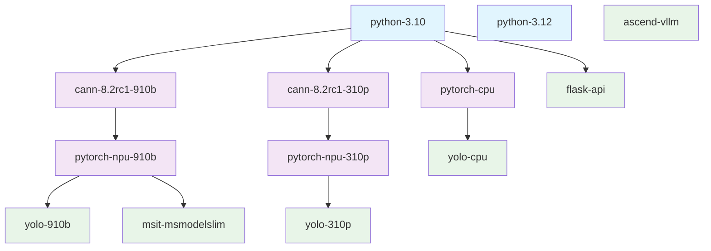

```mermaid
flowchart TD
    python_3.10[python-3.10]
    python_3.12[python-3.12]
    pytorch_cpu[pytorch-cpu]
    cann_8.2rc1_910b[cann-8.2rc1-910b]
    cann_8.2rc1_310p[cann-8.2rc1-310p]
    pytorch_npu_910b[pytorch-npu-910b]
    pytorch_npu_310p[pytorch-npu-310p]
    yolo_cpu[yolo-cpu]
    yolo_910b[yolo-910b]
    yolo_310p[yolo-310p]
    flask_api[flask-api]
    ascend_vllm[ascend-vllm]
    msit_msmodelslim[msit-msmodelslim]
    python_3.10 --> pytorch_cpu
    python_3.10 --> cann_8.2rc1_910b
    python_3.10 --> cann_8.2rc1_310p
    cann_8.2rc1_910b --> pytorch_npu_910b
    cann_8.2rc1_310p --> pytorch_npu_310p
    pytorch_cpu --> yolo_cpu
    pytorch_npu_910b --> yolo_910b
    pytorch_npu_310p --> yolo_310p
    python_3.10 --> flask_api
    pytorch_npu_910b --> msit_msmodelslim
    %% Styling
    classDef baseImage fill:#e1f5fe
    classDef framework fill:#f3e5f5
    classDef application fill:#e8f5e8
    class python_3.10,python_3.12 baseImage
    class pytorch_cpu,cann_8.2rc1_910b,cann_8.2rc1_310p,pytorch_npu_910b,pytorch_npu_310p framework
    class yolo_cpu,yolo_910b,yolo_310p,flask_api,ascend_vllm,msit_msmodelslim application
```
